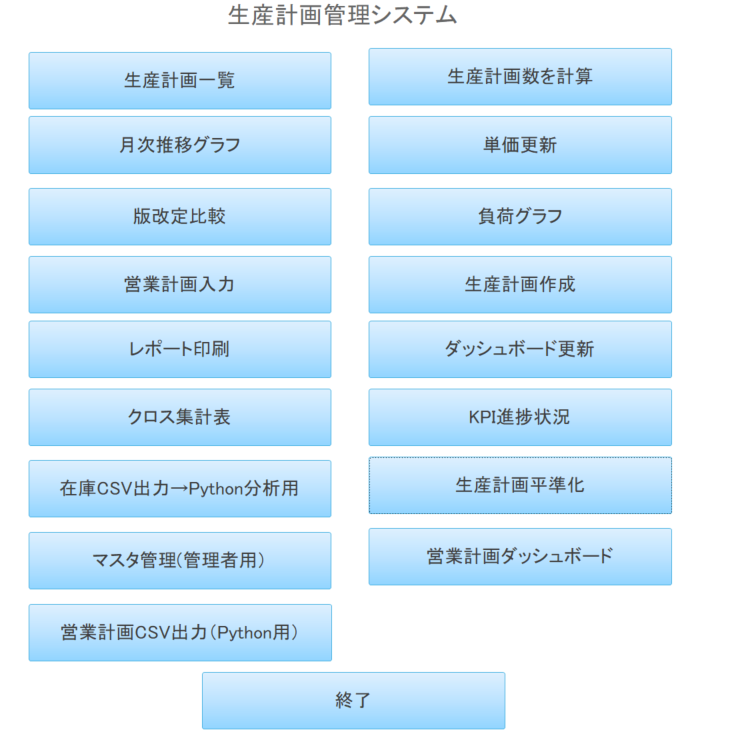
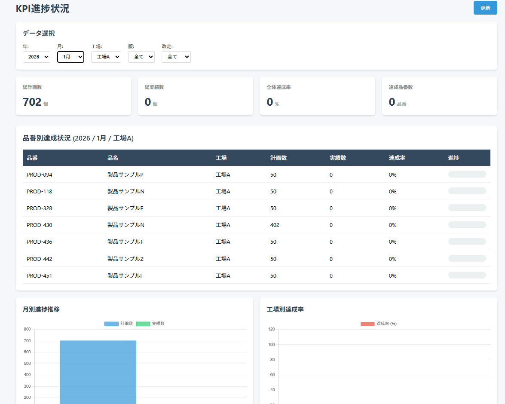
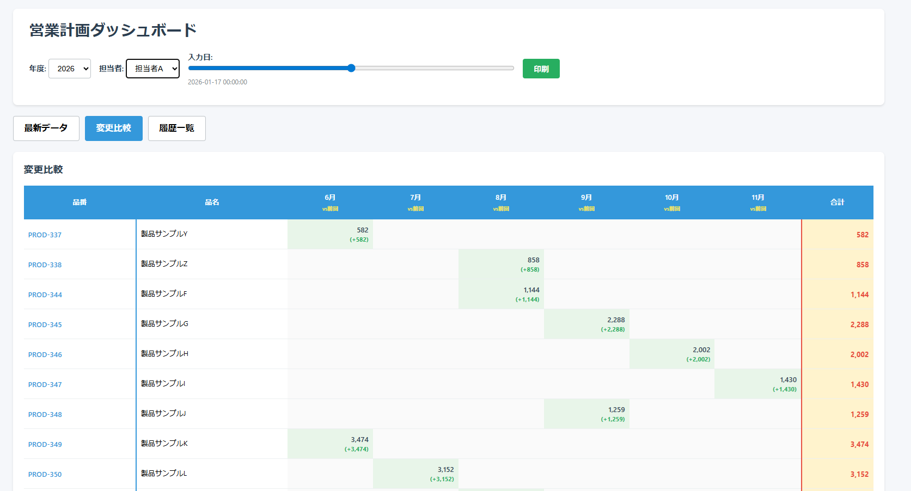
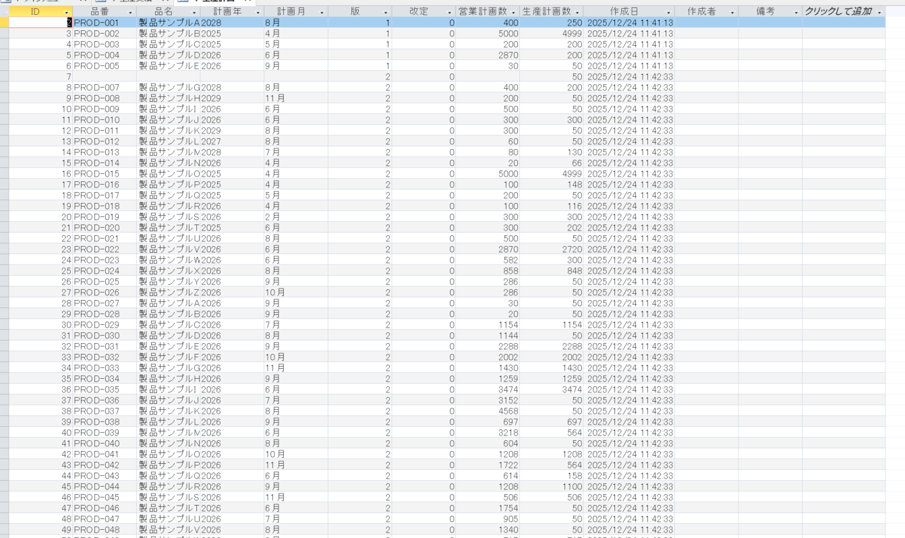
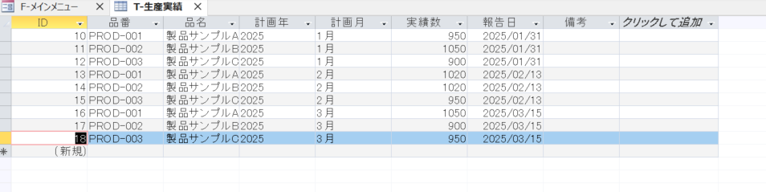
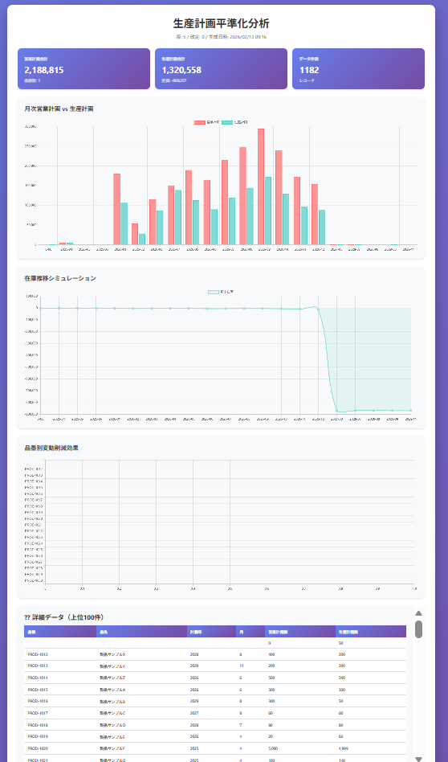

# 生産管理システム (Production Management System)

製造業向けの生産計画・在庫管理システム。Access VBA + Python + HTML/JavaScriptで構築。

## 概要

- **営業計画入力**: Excelテンプレートからの一括取込、履歴管理、変更比較
- **生産計画管理**: 版・改定管理、平準化分析
- **ダッシュボード**: HTMLでリアルタイム可視化（Chart.js / Plotly.js）
- **トレンドラインダッシュボード**: 移動平均・予測線・目標ライン付き高度可視化（NEW）
- **クロス集計表**: 品番×月の計画数、担当者・工場別フィルタ
- **マスタ管理**: 製品・担当者情報の管理

## 技術スタック

- **Backend**: Microsoft Access, VBA
- **分析**: Python (pandas, matplotlib, Plotly)
- **Frontend**: HTML/CSS/JavaScript, Chart.js, Plotly.js
- **環境**: Google Colab

## 主な機能

### 営業計画管理
- Excelからの一括取込
- 入力日ごとの履歴管理
- 前回との変更比較（増減を色分け表示）

### 生産計画管理
- 営業計画からの自動変換
- 版・改定管理
- 平準化分析（変動係数CV計算）

### ダッシュボード
- 工場別負荷グラフ
- KPI表示（前版比較）
- インタラクティブなフィルタ

### 🆕 トレンドラインダッシュボード（v2.0）
- **トレンドライン**（線形回帰による2ヶ月先の予測）
- **3ヶ月移動平均線**（データ傾向の可視化）
- **目標ライン**（任意の目標値を設定・表示）
- チェックボックスでON/OFF切り替え
- グラフクリックで品番別明細をドリルダウン表示
- KPI数値カウントアップアニメーション
- 版・改定ごとの即時比較

## ドキュメント

- [要件定義書](要件定義書.md)
- [操作マニュアル](操作マニュアル.md)
- [ER図](ER図.png)

## 開発背景

製造業の現場で、Excelベースの管理に限界を感じ、10ヶ月でゼロから構築。
AI（Claude）を活用しながら、業務知識とシステム開発スキルを融合。

### 解決した課題
- データの一元管理
- 履歴管理の自動化
- 工数削減（集計作業: 2時間 → 5秒）
- HTMLでのリアルタイム可視化
- 生産平準化の容易化

## 開発期間

2024年4月〜2025年2月（10ヶ月）

## 期待される効果

- **工数削減**: 集計作業 99.9%削減
- **コスト削減**: 外注開発費 500〜700万円削減
- **品質向上**: 手作業ミスの撲滅
- **意思決定の迅速化**: リアルタイム可視化

## 今後の展開

- SQLサーバーへの移行
- Web API化
- Python/Flaskでの再構築
- クラウド化

## 更新履歴

### v2.0 (2025-02-19) 🆕
- トレンドライン機能を追加（線形回帰による2ヶ月先の予測）
- 3ヶ月移動平均線を追加
- 目標ライン（任意の数値で設定可能）を追加
- グラフライブラリをChart.js → Plotly.jsに移行
- チェックボックスによるライン表示のON/OFF切り替え

### v1.0 (2025-02-12)
- 初回リリース
- 工場別負荷グラフ
- KPI表示・前版比較
- ドリルダウン機能
- アニメーション付きKPIカード

## ライセンス

MIT License

## 連絡先

GitHub: [@Tom-zep](https://github.com/Tom-zep)

---

# Production Management System
### Business-Oriented DX Project for Manufacturing

---

## 🚀 Business Impact

This system was developed to replace Excel-based production and inventory planning in a manufacturing environment.

### Key Results
- Manual aggregation time reduced: **2 hours → 5 seconds (99.9% reduction)**
- Estimated external development cost saved: **¥5–7 million**
- Improved production leveling using coefficient of variation (CV)
- Eliminated manual calculation errors
- Enabled real-time decision-making via dashboard visualization

---

## 🏭 Project Overview

An integrated production planning and inventory management system built using:

- Microsoft Access (VBA)
- Python (pandas, matplotlib, Plotly)
- HTML/CSS/JavaScript (Chart.js, Plotly.js)

Designed and implemented over 10 months while working full-time in a manufacturing division.

This project integrates business domain knowledge with system development and data analysis.

---

## 🧩 Core Functions

### Sales Plan Management
- Bulk import from Excel template
- Historical version tracking
- Automated change comparison with visual highlighting

### Production Planning
- Automatic conversion from sales plan
- Version and revision management
- Production leveling analysis (Coefficient of Variation)

### Dashboard (HTML + Chart.js)
- Factory workload visualization
- KPI comparison vs previous version
- Interactive filtering

### 🆕 Trendline Dashboard (HTML + Plotly.js) — v2.0
- **Trendline** (linear regression forecast for 2 months ahead)
- **3-month Moving Average** (trend smoothing)
- **Target Line** (customizable threshold display)
- Toggle each line on/off via checkboxes
- **Drill-down modal**: click any bar to view item-level detail
- Animated KPI counters
- Instant switching between versions and revisions

### Master Data Management
- Product master
- Person-in-charge master

---

## 📊 Technical Stack

**Backend**
- Microsoft Access
- VBA

**Data Analysis**
- Python (pandas, matplotlib, Plotly)
- Google Colab

**Frontend**
- HTML / CSS / JavaScript
- Chart.js
- Plotly.js

---

## 📸 Screenshots

### Main Menu

*System main menu with all available features*

### KPI Dashboard

*Real-time KPI tracking with version comparison and interactive filtering*

### Sales Plan Dashboard

*Monthly sales planning with change tracking and comparison view*

### Production Plan

*Production planning data with version and revision management*

### Product Master

*Product master data management with factory assignment*

### Leveling Analysis

*Production leveling analysis with coefficient of variation and inventory simulation*

### 🆕 Trendline Dashboard

*Advanced dashboard with trendlines, moving averages, target line, and drill-down*

> 📝 **Note**: All screenshots use dummy data to protect confidential information.

---

## 📄 Documentation

- Requirements Definition
- Operation Manual
- ER Diagram

---

## 🤖 Development Approach

Developed using an AI-assisted development workflow (Claude) to accelerate prototyping and implementation.

Focused on:
- Business problem definition
- Measurable impact
- Maintainable structure
- Data-driven decision support

---

## 🔮 Future Roadmap

- Migration to SQL Server
- API-based architecture
- Rebuild using Python (Flask)
- Cloud deployment

---

## ⏳ Development Period

April 2024 – February 2025 (10 months)

---

## 📝 Changelog

### v2.0 (2025-02-19) 🆕
- Added trendline feature (linear regression, 2-month forecast)
- Added 3-month moving average line
- Added customizable target line
- Migrated chart library from Chart.js to Plotly.js
- Added checkbox toggle for each line type

### v1.0 (2025-02-12)
- Initial release
- Factory workload chart
- KPI display with version comparison
- Drill-down functionality
- Animated KPI cards

## 📌 License

MIT License

---

## 👤 Author

Tom  
Manufacturing DX | Process Improvement | Data-Driven Systems  
GitHub: https://github.com/Tom-zep
