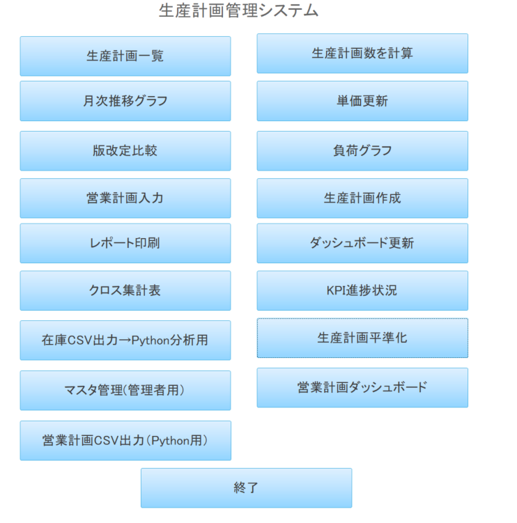
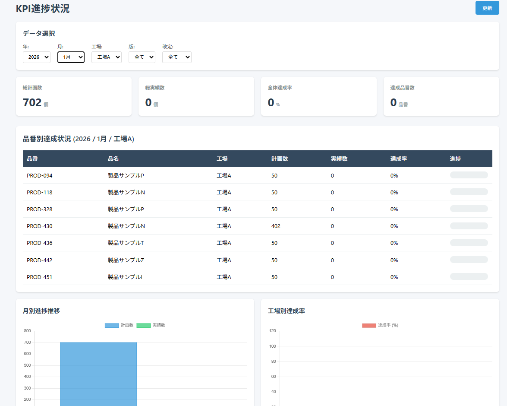
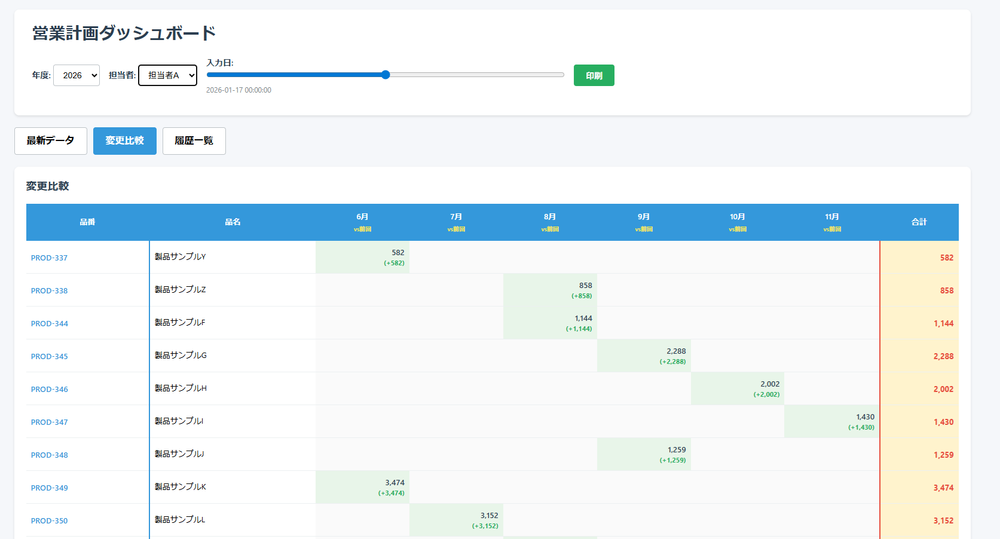
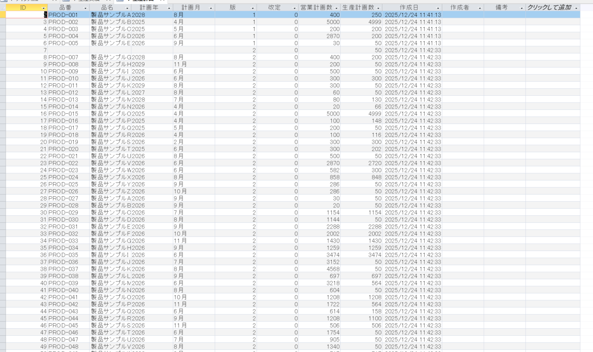
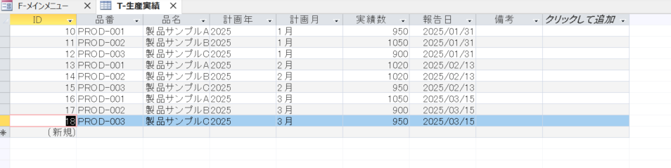
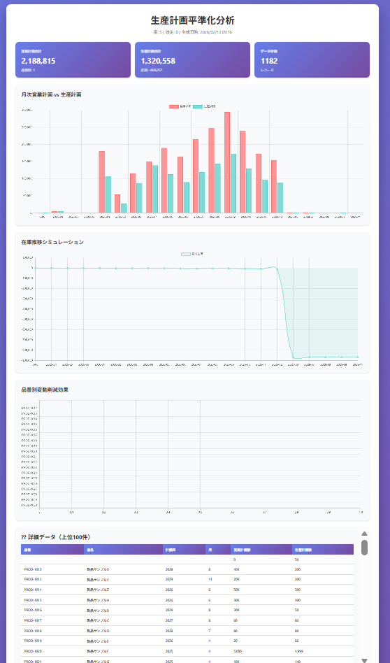
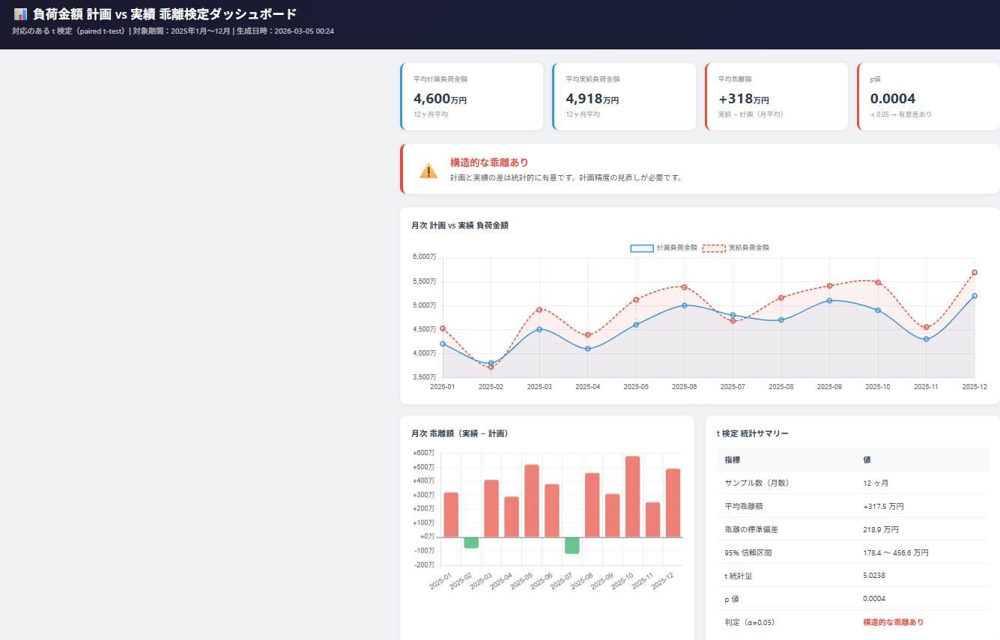

# Production-management-system　 生産管理システム


製造業向けの生産計画・在庫管理システム。Access VBA + Python + HTML/JavaScriptで構築。

## 概要

- **営業計画入力**: Excelテンプレートからの一括取込、履歴管理、変更比較
- **生産計画管理**: 版・改定管理、平準化分析
- **ダッシュボード**: HTMLでリアルタイム可視化（Chart.js / Plotly.js）
- **トレンドラインダッシュボード**: 移動平均・予測線・目標ライン付き高度可視化（NEW）
- **クロス集計表**: 品番×月の計画数、担当者・工場別フィルタ
- **マスタ管理**: 製品・担当者情報の管理

## 技術スタック

- **Backend**: Microsoft Access, VBA
- **分析**: Python (pandas, matplotlib, Plotly)
- **Frontend**: HTML/CSS/JavaScript, Chart.js, Plotly.js
- **環境**: Google Colab

## 主な機能

### 営業計画管理
- Excelからの一括取込
- 入力日ごとの履歴管理
- 前回との変更比較（増減を色分け表示）

### 生産計画管理
- 営業計画からの自動変換
- 版・改定管理
- 平準化分析（変動係数CV計算）

### ダッシュボード
- 工場別負荷グラフ
- KPI表示（前版比較）
- インタラクティブなフィルタ

### 🆕 トレンドラインダッシュボード（v2.0）
- **トレンドライン**（線形回帰による2ヶ月先の予測）
- **3ヶ月移動平均線**（データ傾向の可視化）
- **目標ライン**（任意の目標値を設定・表示）
- チェックボックスでON/OFF切り替え
- グラフクリックで品番別明細をドリルダウン表示
- KPI数値カウントアップアニメーション
- 版・改定ごとの即時比較

## ドキュメント

- [要件定義書](要件定義書.md)
- [操作マニュアル](操作マニュアル.md)
- [ER図](ER図.png)

## 開発背景

製造業の現場で、Excelベースの管理に限界を感じ、10ヶ月でゼロから構築。
AI（Claude）を活用しながら、業務知識とシステム開発スキルを融合。

### 解決した課題
- データの一元管理
- 履歴管理の自動化
- 工数削減（集計作業: 2時間 → 5秒）
- HTMLでのリアルタイム可視化
- 生産平準化の容易化

## 開発期間

2024年4月〜2025年2月（10ヶ月）

## 期待される効果

- **工数削減**: 集計作業 99.9%削減
- **コスト削減**: 外注開発費 500〜700万円削減
- **品質向上**: 手作業ミスの撲滅
- **意思決定の迅速化**: リアルタイム可視化

## 今後の展開

- SQLサーバーへの移行
- Web API化
- Python/Flaskでの再構築
- クラウド化

## 更新履歴
### v2.3 (2026-03-13)
#### 負荷金額 計画 vs 実績 乖離検定ダッシュボード

**概要**
月次の計画負荷金額と実績負荷金額の差が「偶然のブレ」なのか「構造的な問題」なのかを、対応のある t 検定（paired t-test）で統計的に判定するダッシュボードを追加。経営層向けに「感覚」ではなく「数値的根拠」でコスト超過を説明できる。

**技術的なポイント**
- `scipy.stats.ttest_rel` で対応のある t 検定を実装
- `pandas` で月次乖離額・平均・標準偏差を集計
- 95% 信頼区間を自動計算（`stats.t.interval`）
- p値に応じて判定バナーを動的に切り替え（有意差あり／なし）
- Chart.js で計画 vs 実績の折れ線・乖離棒グラフを HTML に直接埋め込み

**新機能**
- 月次 計画 vs 実績 折れ線グラフ
- 月次 乖離額 棒グラフ（超過：赤／削減：緑）
- t 検定 統計サマリーテーブル（t統計量・p値・95%信頼区間）
- 判定バナー（構造的な乖離あり ⚠️ ／ 偶然の範囲内 ✅）
- KPI カード（平均計画・平均実績・平均乖離額・p値）

**実行方法**
```bash
pip install pandas scipy numpy
python generate_cost_ttest_dashboard.py


###v2.2 アップデート概要 (2026-03-05)
Accessからデータを抽出し、Pythonによる統計解析を経て、意思決定用のHTMLダッシュボードを自動生成するパイプラインを構築しました。455品番、5,460レコードの月次データを処理し、属人的な「勘」を「データドリブンな在庫管理」へと変革します。

### 🛠 技術的なポイント
- **データパイプライン:** `pyodbc` を使用し、Access内の在庫・製品・生産計画テーブルをSQL結合。
- **統計解析:** `pandas` で季節係数（月次在庫 ÷ 年間平均）を自動算出。
- **ロジック実装:** 係数に基づいた動的な適正在庫ライン（1.2倍）および安全在庫ライン（0.6倍）の算出。
- **フロントエンド:** Pythonのf-stringを活用し、`Chart.js` データをHTMLに動的に埋め込み。

### ✨ 新機能
- **季節係数ヒートマップ:** 12ヶ月の需要波形を視覚化。
- **3層在庫推移グラフ:** 実在庫・適正・安全ラインを同時表示。
- **カテゴリ分析:** 冬・春・通年別の在庫内訳を積み上げ表示。
- **自動ステータス判定:** 品番別の在庫状況（適正・不足・過剰）を自動判定。

※表示されている数値はデモンストレーション用の**サンプル数字**です。

---
### v2.1 (2025-02-26) 
#### VBA → Python 移行 + 生産実績可視化機能の追加

**■ 移行の背景**
社内でPythonの利用環境が整ったため、従来のVBAによるダッシュボードをPythonへリプレイスしました。
VBAでHTMLやJavaScriptを文字列連結して生成していた構造に限界を感じており、保守性の向上とデバッグの効率化を目的としています。

**■ 移行による改善点**
- **保守性の向上:** HTML生成ロジックをPython側に集約し、構造を最適化。
- **データ処理の高速化:** `pandas` / `numpy` を活用した集計・トレンド計算の実装。
- **堅牢性の確保:** JSONの特殊文字によるバグリスクを、Pythonの標準処理により自動解消。
- **デバッグの容易化:** VBAの文字列管理から解放され、ロジックの修正が劇的にスムーズに。

**■  新機能：生産実績の可視化**
- **KPIカード:** 今日の生産実績合計をダイレクトに表示。
- **マルチ軸グラフ:** 月次負荷グラフに実績ラインを追加（右軸）。
- **工場別分析:** 実績金額の内訳を円グラフで可視化。
- **インタラクティブ表示:** チェックボックスによる実績ラインの表示/非表示切り替え。

**■ 技術比較**
| 項目 | VBA版 (Legacy) | Python版 (v2.1) |
|---|---|---|
| 開発・移行工数 | 約2週間 | **約1時間** |
| JSON安全性 | 手動エスケープが必要 | **ネイティブ処理（自動）** |
| 保守性 | 困難（文字列連結） | **大幅に向上（構造化）** |

**■ 使用ライブラリ**
- `pyodbc` (Access接続)
- `pandas` (データ加工)
- `numpy` (線形回帰・数値計算)
- `jinja2` (HTMLテンプレート)

---

### v2.0 (2025-02-19)
- トレンドライン機能を追加（線形回帰による2ヶ月先の予測）
- 3ヶ月移動平均線を追加
- 目標ライン（任意の数値で設定可能）を追加
- グラフライブラリをChart.js → Plotly.jsに移行
- チェックボックスによるライン表示のON/OFF切り替え

### v1.0 (2025-02-12)
- 初回リリース
- 工場別負荷グラフ
- KPI表示・前版比較
- ドリルダウン機能
- アニメーション付きKPIカード

## ライセンス

MIT License

## 連絡先

GitHub: [@Tom-zep](https://github.com/Tom-zep)

---

# Production Management System
### Business-Oriented DX Project for Manufacturing

---

## 🚀 Business Impact

This system was developed to replace Excel-based production and inventory planning in a manufacturing environment.

### Key Results
- Manual aggregation time reduced: **2 hours → 5 seconds (99.9% reduction)**
- Estimated external development cost saved: **¥5–7 million**
- Improved production leveling using coefficient of variation (CV)
- Eliminated manual calculation errors
- Enabled real-time decision-making via dashboard visualization

---

## 🏭 Project Overview

An integrated production planning and inventory management system built using:

- Microsoft Access (VBA)
- Python (pandas, matplotlib, Plotly)
- HTML/CSS/JavaScript (Chart.js, Plotly.js)

Designed and implemented over 10 months while working full-time in a manufacturing division.

This project integrates business domain knowledge with system development and data analysis.

---

## 🧩 Core Functions

### Sales Plan Management
- Bulk import from Excel template
- Historical version tracking
- Automated change comparison with visual highlighting

### Production Planning
- Automatic conversion from sales plan
- Version and revision management
- Production leveling analysis (Coefficient of Variation)

### Dashboard (HTML + Chart.js)
- Factory workload visualization
- KPI comparison vs previous version
- Interactive filtering

### 🆕 Trendline Dashboard (HTML + Plotly.js) — v2.0
- **Trendline** (linear regression forecast for 2 months ahead)
- **3-month Moving Average** (trend smoothing)
- **Target Line** (customizable threshold display)
- Toggle each line on/off via checkboxes
- **Drill-down modal**: click any bar to view item-level detail
- Animated KPI counters
- Instant switching between versions and revisions

### Master Data Management
- Product master
- Person-in-charge master

---

## 📊 Technical Stack

**Backend**
- Microsoft Access
- VBA

**Data Analysis**
- Python (pandas, matplotlib, Plotly)
- Google Colab

**Frontend**
- HTML / CSS / JavaScript
- Chart.js
- Plotly.js

---

## 📸 Screenshots

### Main Menu

*System main menu with all available features*

### KPI Dashboard

*Real-time KPI tracking with version comparison and interactive filtering*

### Sales Plan Dashboard

*Monthly sales planning with change tracking and comparison view*

### Production Plan

*Production planning data with version and revision management*

### Product Master

*Product master data management with factory assignment*

### Leveling Analysis

*Production leveling analysis with coefficient of variation and inventory simulation*

###  Trendline Dashboard

*Advanced dashboard with trendlines, moving averages, target line, and drill-down*

###  Trendline Dashboard created by python

*Advanced dashboard with trendlines, moving averages, target line, and drill-down*

### 🎥 System Demo

*45-second demo: Automated Seasonality Indexing & Inventory Guardrails.*

## 🆕 v2.3: Statistical Cost Variance Analysis (t-test)


> **"From Intuition to Evidence"**
> This update visualizes the structural gap between planned and actual costs using paired t-tests.

> 📝 **Note**: All screenshots use dummy data to protect confidential information.

---

## 📄 Documentation

- Requirements Definition
- Operation Manual
- ER Diagram

---

## 🤖 Development Approach

Developed using an AI-assisted development workflow (Claude) to accelerate prototyping and implementation.

Focused on:
- Business problem definition
- Measurable impact
- Maintainable structure
- Data-driven decision support

---

## 🔮 Future Roadmap

- Migration to SQL Server
- API-based architecture
- Rebuild using Python (Flask)
- Cloud deployment

---

## ⏳ Development Period

April 2024 – February 2025 (10 months)

---

## 📝 Changelog
### 🚀 Release Overview (v2.2)(2026-03-06)
Developed an automated data pipeline that extracts data from Microsoft Access, performs statistical analysis via Python, and generates an interactive HTML dashboard for strategic decision-making. 
Processing 5,460 records across 455 SKUs to transform empirical "intuition" into "Data-Driven Inventory Management."

### 🛠 Technical Highlights
- **Data Pipeline:** SQL-based table joining (Inventory, Product, Production Plan) from Access via `pyodbc`.
- **Analytics:** Automated calculation of the **Seasonality Index** (Monthly Inventory / Annual Average) using `pandas`.
- **Logic Implementation:** Dynamic calculation of Optimal Stock levels (1.2x index) and Safety Stock levels (0.6x index).
- **Frontend:** Dynamic HTML generation using Python f-strings to inject data into `Chart.js`.

### ✨ Key Features
- **Seasonality Heatmap:** Visualizes demand fluctuations over a 12-month cycle.
- **3-Layer Inventory Chart:** Simultaneous display of actual, optimal, and safety stock levels.
- **Category Analysis:** Stacked bar charts for seasonal categories (Winter, Spring, Year-round).
- **Auto-Status Detection:** Automated classification of stock status (Optimal, Shortage, Overstock) per SKU.

*Note: The figures shown in the demonstration are **sample data** for display purposes.*

---

## 🏃 How to Run
1. `python setup_dummy_data.py` (First time only)
2. `python generate_dashboard.py`
-> Opens `dashboard_output.html` in your browser.


### Production Management Dashboard v2.1 (2025-02-26)
### VBA to Python Migration & Performance Visualization
---
#### 🚀 Quick Summary 
- **Migration:** Transitioned from VBA to Python to improve maintainability and scalability.
- **Key Stack:** Python (pandas, numpy, pyodbc), Access DB, HTML/JS.
- **Outcome:** Eliminated complex string concatenation in VBA; reduced deployment time from weeks to hours.
- **New Feature:** Real-time production performance tracking with KPI cards and trend lines.
---

### v2.0 (2025-02-19) 
- Added trendline feature (linear regression, 2-month forecast)
- Added 3-month moving average line
- Added customizable target line
- Migrated chart library from Chart.js to Plotly.js
- Added checkbox toggle for each line type

### v1.0 (2025-02-12)
- Initial release
- Factory workload chart
- KPI display with version comparison
- Drill-down functionality
- Animated KPI cards

## 📌 License

MIT License

---

## 👤 Author

Tom  
Manufacturing DX | Process Improvement | Data-Driven Systems  
GitHub: https://github.com/Tom-zep
